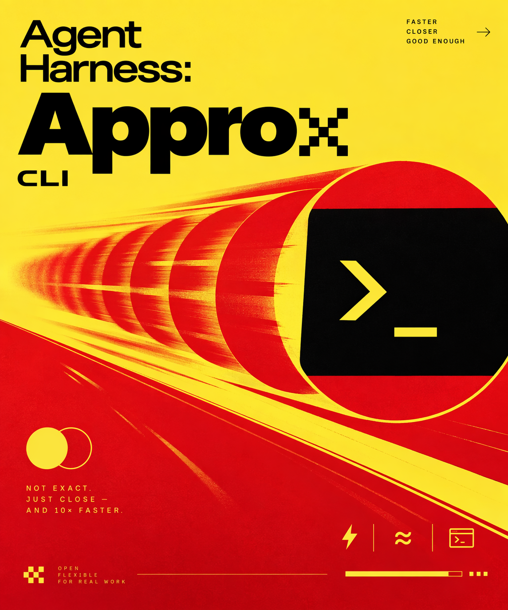

# Approx

简体中文 | [English](README.md)

Approx 是一个运行在终端里的编程智能体工作区，由
[Pi](https://github.com/earendil-works/pi) 驱动。你可以在这里聊天、制定计划、
查看文件变更，并处理项目的 Git 操作。

<p align="center">
  
</p>

Approx v0.1.1 当前正式验证环境为 Windows Terminal 与 PowerShell 7。

## 安装

环境要求：Windows 10/11，Node.js 22.19 或更高版本。

```powershell
$ErrorActionPreference = 'Stop'
npm install --global @bgtbeigulol-png/approx
approx
```

也可以从源码运行：

```powershell
$ErrorActionPreference = 'Stop'
git clone https://github.com/bgtbeigulol-png/Approx.git
Set-Location -LiteralPath .\Approx
npm ci
npm start
```

## 首次运行

在要处理的项目目录中运行 `approx`。Approx 会复用 Pi 已有的服务商和模型配置。
如果当前没有可用模型，Approx 会直接打开自己的配置界面，你不需要离开应用。

凭据由 Pi 保存在用户配置中。Approx 不会把 API Key 写入项目文件、偏好设置或
对话内容。

## 日常使用

```powershell
$ErrorActionPreference = 'Stop'
approx --continue      # 继续最近一次对话
approx --no-splash     # 跳过启动动画
approx --scripted      # 运行离线演示
approx update          # 安装最新版本
approx --version       # 显示已安装版本
approx --help
```

| 按键 | 操作 |
| --- | --- |
| `Enter` | 发送 |
| `Shift+Enter` | 换行 |
| `Shift+Tab` | 切换 Go / Plan |
| `Ctrl+P` | 命令面板 |
| `Ctrl+K` | Git 工作台 |
| `Ctrl+B` | Approde 技能与 Prompt |
| `Ctrl+O` | 设置 |
| `Ctrl+G` | 快速跳转 |
| `Ctrl+S` | 已保存对话 |
| `Ctrl+L` | 清空上下文 |
| `Esc` | 中止或关闭 |
| `Ctrl+C` | 退出 |

输入 `/help` 查看完整列表，输入 `/git` 打开 Git 工作台。

在输入框中键入 `@` 可以引用工作区文件。Approx 会补全嵌套项目路径、自动为含空格
的路径加引号，并把引用作为普通 Prompt 文本原样交给 Pi；只有确实需要内容时才读取
对应文件。

## 更新

在任意终端运行 `approx update` 即可检查并安装最新版本。Git checkout 会跟随
当前配置的 upstream，要求工作区干净，并在 fast-forward 拉取后同步 npm 依赖；
npm 安装版会查询 registry，并全局安装精确的最新发布版本。Settings 中可以控制
更新提示和自动更新；在交互式终端中，独立更新器会用一张紧凑的实时卡片展示进度，
完成后恢复 Shell 光标。应用内也可以使用 `/update`、`/update install` 和
`/update hide` 完成同一流程。

`approx update --help` 只显示独立更新器说明，不会连接 Git 或 npm 更新通道。

## Plan Mode

Go Mode 会立即开始工作。Plan Mode 会先问几个关键问题并展示方案，再让智能体
修改文件。按 `Y` 或 `Enter` 批准，按 `N` 要求修改。Plan 状态会随会话保存；
智能体工作期间若计划被编辑，它会从最新快照重新开始。

## Approde

按 `Ctrl+B` 或输入 `/approde` 打开 Approde。右侧停靠栏可以在不丢失对话的前提下
启用或禁用 Pi 发现的技能与 Prompt，也可以保存命名预设、恢复上次使用的集合，并在
应用前审核模型主动请求的变更。

## 状态与 Effort

`/status` 提供四页状态表，分别展示上下文占用、近期 Token 活动、模型与 Effort
分布以及成本汇总；用量历史会在本地保留最多 90 天。`/effort` 会打开当前模型支持的
推理等级选择器；一轮工作期间选择的新等级从下一轮开始生效。

Effort 光谱按终端中的物理位置从左侧的快速/浅层推理延伸到右侧的深度推理。High
使用银灰星光文字，XHigh 会把整个面板变成带流星和火星的夜空，Max 则在星空下加入
带反光与多层波浪边界的动态海洋。任意档位之间都会从当前可见画面渐入渐出，快速
跨多档也不会硬切；开启“减少动态效果”后会保留静态场景。`/effort-debug` 可以预览
全部七档，但不会修改当前模型、Effort 或 backend 状态。

## Git 工作台

按 `Ctrl+K` 或输入 `/git` 打开。这里会显示当前分支、最近提交、工作区改动、已
暂存改动、净行数统计和选中文件的差异，也可以直接暂存、取消暂存、确认后丢弃、
刷新和提交。二进制文件会显示明确标签，超大差异会在拖垮终端进程前截断预览。

一轮对话产生的文件编辑会在记录中合并成简洁的变更摘要，需要时展开即可查看。

编辑较早的消息会回退 Pi 会话分支并恢复已捕获的 Write/Edit 文件快照；单步重做会
重新接回被放弃的分支并重放对应文件状态。

## 常见问题

**没有可用模型**

完成 Approx 自动打开的配置界面。已有 Pi 凭据和自定义模型设置会自动复用。

**系统找不到 `approx`**

全局安装后重启终端，并检查 npm 全局路径：

```powershell
$ErrorActionPreference = 'Stop'
npm prefix --global
Get-Command approx
```

**界面显示错位**

使用支持 UTF-8、Unicode 方框字符、24 位颜色和鼠标的 Windows Terminal。

## 许可证

[MIT](LICENSE)
