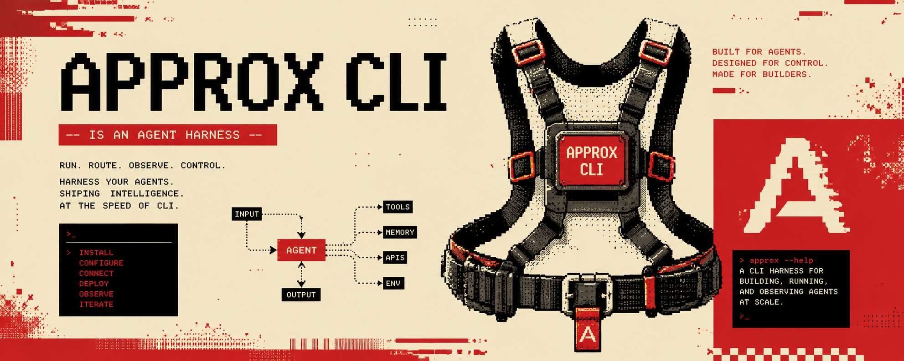

# Approx

简体中文 | [English](README.md)

<p align="center">
  
</p>

<p align="center">
  
</p>

Approx 是一个运行在终端里的编程智能体工作区，由
[Pi](https://github.com/earendil-works/pi) 驱动。你可以在这里聊天、制定计划、
查看文件变更，并处理项目的 Git 操作。

当前版本是早期 beta，正式验证环境为 Windows Terminal 与 PowerShell 7。

## 安装

环境要求：Windows 10/11，Node.js 22.19 或更高版本。

```powershell
$ErrorActionPreference = 'Stop'
npm install --global @bgtbeigulol-png/approx@beta
approx
```

也可以从源码运行：

```powershell
$ErrorActionPreference = 'Stop'
git clone https://github.com/bgtbeigulol-png/Approx.git
Set-Location -LiteralPath .\Approx
npm ci
npm start
```

## 首次运行

在要处理的项目目录中运行 `approx`。Approx 会复用 Pi 已有的服务商和模型配置。
如果当前没有可用模型，Approx 会直接打开自己的配置界面，你不需要离开应用。

凭据由 Pi 保存在用户配置中。Approx 不会把 API Key 写入项目文件、偏好设置或
对话内容。

## 日常使用

```powershell
$ErrorActionPreference = 'Stop'
approx --continue      # 继续最近一次对话
approx --no-splash     # 跳过启动动画
approx --scripted      # 运行离线演示
approx --help
```

| 按键 | 操作 |
| --- | --- |
| `Enter` | 发送 |
| `Shift+Enter` | 换行 |
| `Shift+Tab` | 切换 Go / Plan |
| `Ctrl+P` | 命令面板 |
| `Ctrl+K` | Git 工作台 |
| `Ctrl+O` | 设置 |
| `Ctrl+G` | 快速跳转 |
| `Ctrl+S` | 已保存对话 |
| `Ctrl+L` | 清空上下文 |
| `Esc` | 中止或关闭 |
| `Ctrl+C` | 退出 |

输入 `/help` 查看完整列表，输入 `/git` 打开 Git 工作台。

## Plan Mode

Go Mode 会立即开始工作。Plan Mode 会先问几个关键问题并展示方案，再让智能体
修改文件。按 `Y` 或 `Enter` 批准，按 `N` 要求修改。

## Git 工作台

按 `Ctrl+K` 或输入 `/git` 打开。这里会显示当前分支、最近提交、工作区改动、已
暂存改动和选中文件的差异，也可以直接暂存、取消暂存、刷新和提交。

一轮对话产生的文件编辑会在记录中合并成简洁的变更摘要，需要时展开即可查看。

## 常见问题

**没有可用模型**

完成 Approx 自动打开的配置界面。已有 Pi 凭据和自定义模型设置会自动复用。

**系统找不到 `approx`**

全局安装后重启终端，并检查 npm 全局路径：

```powershell
$ErrorActionPreference = 'Stop'
npm prefix --global
Get-Command approx
```

**界面显示错位**

使用支持 UTF-8、Unicode 方框字符、24 位颜色和鼠标的 Windows Terminal。

## 许可证

[MIT](LICENSE)
